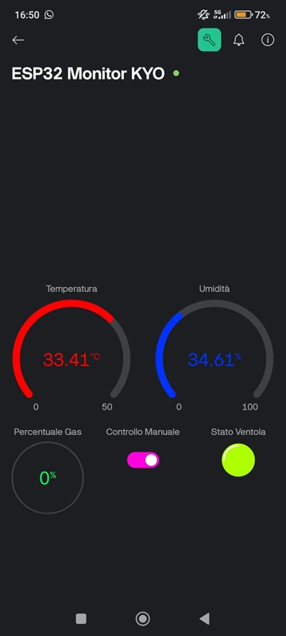

🇮🇹 This README is also available in Italian: README_IT.md

# 📡 ESP32 Environmental Sensor with Blynk

A project based on **ESP32** that monitors in real time:
- 🌡️ Temperature
- 💧 Humidity
- 🧪 Gas (MQ-2)
- 🌬️ Automatically activates a fan when needed

Sensor data is visualized on **Blynk**, and a LED indicates the system status.

---

## ⚙️ Hardware Components

| Component               | Model                  |
|-------------------------|------------------------|
| Microcontroller         | ESP32 Dev Module       |
| Temp/Humidity Sensor    | HTU21D (I2C)           |
| Gas Sensor              | MQ-2 (analog input)    |
| LED + Resistor          | 220Ω                   |
| Fan (optional)          | Connected to GPIO 23   |

---

## 📷 Circuit Diagram


---

## 💻 How It Works

- Every **2 seconds**, the ESP32 reads:
  - HTU21D → temperature & humidity
  - MQ-2 → gas level (converted to %)
- Data is sent to Blynk:
  - `V0`: gas level
  - `V1`: temperature
  - `V2`: humidity
  - `V3`: fan state (ON/OFF)
  - `V4`: manual control (switch)
- The fan activates if:
  - Temperature ≥ 40°C
  - Gas level ≥ 15%
  - Or manually via Blynk app

---

## 🔌 Main Wiring

| ESP32 Pin | Connection         |
|-----------|--------------------|
| 21 (SDA)  | SDA → HTU21D       |
| 22 (SCL)  | SCL → HTU21D       |
| 34        | MQ-2 analog input  |
| 23        | LED / Fan output   |
| 3V3       | Power supply (+)   |
| GND       | Ground (−)         |

---

## 📲 Blynk Dashboard Setup

Template: **ESP32 Monitor**  
Auth Token: stored in the code  

**Recommended Widgets**:
- Gauges for temperature, humidity, gas
- Switch (`V4`) for manual fan control
- LED widget (`V3`) for fan status

---

## 📱 Blynk App Screenshots

### 🌐 Web Dashboard


### 📲 Mobile App



---

## 🧠 Author

**Giuseppe Cialdella**  
📧 giuseppecialdella97@gmail.com  
🔗 [LinkedIn](https://www.linkedin.com/in/giuseppe-cialdella-2b582a295)  
📍 Student in Cybersecurity & Programming

---

## 📁 Included Files

- `main.ino`: complete ESP32 Arduino code
- `A_digital_illustration_provides_an_electronic_circ.png`: circuit diagram

---

## 🚀 Future Improvements

- ✅ Integration with MQTT or Node-RED
- 📊 Visualization via Grafana or ThingsBoard
- 🔋 Power optimization using sleep modes
- ☁️ Integration with Google Sheets or Telegram Bot

---

## 📥 Clone this Project

```bash
git clone https://github.com/kyoto976/Sensore-Ambientale.git
